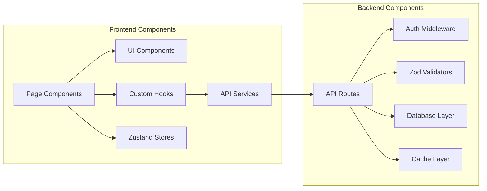
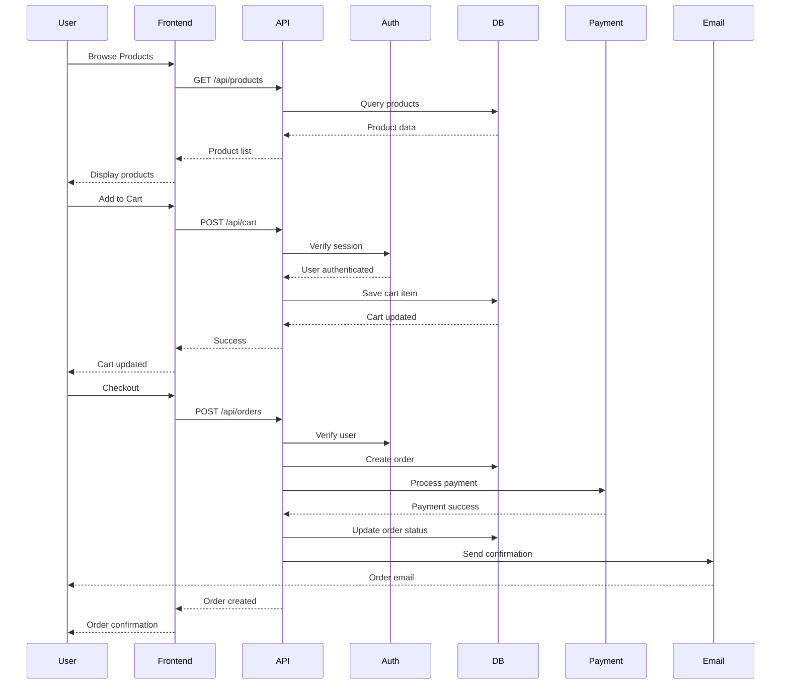

## API Specification

### REST API Specification

```yaml
openapi: 3.0.0
info:
  title: GangRun Printing API
  version: 1.0.0
  description: E-commerce API for printing products
servers:
  - url: http://localhost:3002/api
    description: Development server
  - url: https://gangrunprinting.com/api
    description: Production server

paths:
  /auth/register:
    post:
      summary: Register new user
      requestBody:
        content:
          application/json:
            schema:
              type: object
              required: [email, password, name]
              properties:
                email: { type: string, format: email }
                password: { type: string, minLength: 8 }
                name: { type: string }
      responses:
        201: { description: User created }
        400: { description: Validation error }

  /products:
    get:
      summary: List products with filtering
      parameters:
        - name: category
          in: query
          schema: { type: string }
        - name: search
          in: query
          schema: { type: string }
        - name: page
          in: query
          schema: { type: integer, default: 1 }
        - name: limit
          in: query
          schema: { type: integer, default: 20 }
      responses:
        200:
          description: Product list
          content:
            application/json:
              schema:
                type: object
                properties:
                  products: { type: array }
                  total: { type: integer }
                  page: { type: integer }

  /products/{slug}:
    get:
      summary: Get product details
      parameters:
        - name: slug
          in: path
          required: true
          schema: { type: string }
      responses:
        200: { description: Product details }
        404: { description: Product not found }

  /cart:
    get:
      summary: Get current cart
      security: [{ bearerAuth: [] }]
      responses:
        200: { description: Cart contents }

    post:
      summary: Add item to cart
      security: [{ bearerAuth: [] }]
      requestBody:
        content:
          application/json:
            schema:
              type: object
              required: [productId, quantity]
              properties:
                productId: { type: string }
                quantity: { type: integer, minimum: 1 }
                configuration: { type: object }
      responses:
        200: { description: Item added }

  /orders:
    post:
      summary: Create order from cart
      security: [{ bearerAuth: [] }]
      requestBody:
        content:
          application/json:
            schema:
              type: object
              required: [shippingAddress, billingAddress]
      responses:
        201: { description: Order created }

    get:
      summary: List user orders
      security: [{ bearerAuth: [] }]
      responses:
        200: { description: Order list }

  /orders/{id}:
    get:
      summary: Get order details
      security: [{ bearerAuth: [] }]
      parameters:
        - name: id
          in: path
          required: true
          schema: { type: string }
      responses:
        200: { description: Order details }
        404: { description: Order not found }

  /upload:
    post:
      summary: Upload artwork file
      security: [{ bearerAuth: [] }]
      requestBody:
        content:
          multipart/form-data:
            schema:
              type: object
              properties:
                file: { type: string, format: binary }
                orderId: { type: string }
      responses:
        200: { description: File uploaded }

  /search:
    get:
      summary: Search products with autocomplete
      parameters:
        - name: q
          in: query
          required: true
          schema: { type: string }
      responses:
        200:
          description: Search results
          content:
            application/json:
              schema:
                type: object
                properties:
                  results: { type: array }
                  suggestions: { type: array }

components:
  securitySchemes:
    bearerAuth:
      type: http
      scheme: bearer
      bearerFormat: JWT
```

## Components

### Frontend Application

**Responsibility:** Customer-facing web interface with PWA capabilities

**Key Interfaces:**

- React components for UI rendering
- API client services for backend communication
- Zustand stores for state management

**Dependencies:** Next.js, React, Tailwind CSS, shadcn/ui

**Technology Stack:** TypeScript, React 19, Next.js 15 App Router

### API Layer

**Responsibility:** RESTful API endpoints for all business operations

**Key Interfaces:**

- /api/auth/\* - Authentication endpoints
- /api/products/\* - Product management
- /api/orders/\* - Order processing
- /api/cart/\* - Shopping cart operations

**Dependencies:** Prisma ORM, NextAuth.js, PostgreSQL

**Technology Stack:** Next.js API Routes, TypeScript, Prisma

### Authentication Service

**Responsibility:** User authentication and session management

**Key Interfaces:**

- OAuth providers (Google)
- Email/password authentication
- Session management
- Role-based access control

**Dependencies:** NextAuth.js, Prisma Adapter, PostgreSQL

**Technology Stack:** NextAuth.js v5, JWT/Database sessions

### File Storage Service

**Responsibility:** Artwork and asset file management

**Key Interfaces:**

- Upload API for artwork files
- Image optimization for products
- Secure file access with presigned URLs

**Dependencies:** MinIO, Sharp for image processing

**Technology Stack:** MinIO (S3-compatible), Next.js Image optimization

### Email Service

**Responsibility:** Transactional and marketing email delivery

**Key Interfaces:**

- Order confirmation emails
- Password reset emails
- Marketing campaigns
- Email templates

**Dependencies:** Resend API

**Technology Stack:** Resend, React Email templates

### Payment Processing

**Responsibility:** Handle payment transactions

**Key Interfaces:**

- Square payment integration
- Payment method storage
- Refund processing
- Webhook handlers

**Dependencies:** Square SDK

**Technology Stack:** Square API, Webhook processing

### Cache Layer

**Responsibility:** Performance optimization through caching

**Key Interfaces:**

- Session storage
- API response caching
- Product catalog caching
- Search result caching

**Dependencies:** Redis

**Technology Stack:** Redis 7.0, ioredis client

### Component Diagrams



## External APIs

### Resend API

- **Purpose:** Email delivery service for transactional and marketing emails
- **Documentation:** https://resend.com/docs
- **Base URL(s):** https://api.resend.com
- **Authentication:** API Key (Bearer token)
- **Rate Limits:** 100 emails/day (free tier), 10,000/month (paid)

**Key Endpoints Used:**

- `POST /emails` - Send transactional emails
- `POST /batch` - Send bulk emails
- `GET /emails/{id}` - Check email status

**Integration Notes:** Integrated with React Email for template rendering

### Square API

- **Purpose:** Payment processing and transaction management
- **Documentation:** https://developer.squareup.com/docs
- **Base URL(s):** https://connect.squareup.com
- **Authentication:** OAuth 2.0 with access token
- **Rate Limits:** 700 requests/minute

**Key Endpoints Used:**

- `POST /v2/payments` - Process payments
- `POST /v2/customers` - Create customer profiles
- `POST /v2/cards` - Store payment methods
- `POST /v2/refunds` - Process refunds

**Integration Notes:** Webhook handlers for payment events

### Google Analytics

- **Purpose:** Website analytics and user behavior tracking
- **Documentation:** https://developers.google.com/analytics
- **Base URL(s):** https://www.google-analytics.com
- **Authentication:** Measurement ID (public)
- **Rate Limits:** 10 million hits per month per property

**Key Endpoints Used:**

- `POST /mp/collect` - Send events (GA4)
- Page view tracking (automatic)
- Custom events for e-commerce

**Integration Notes:** Implemented via gtag.js with custom event tracking

## Core Workflows



