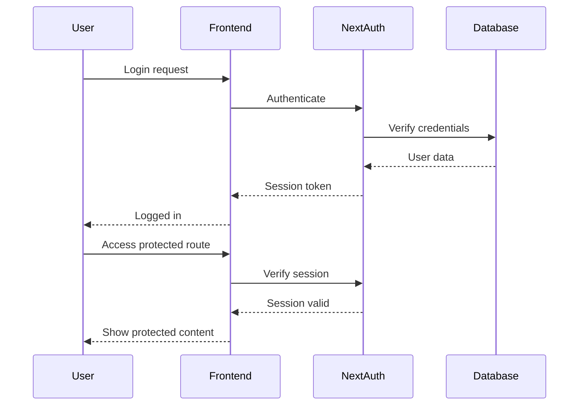

## Backend Architecture

### Service Architecture

#### Traditional Server

##### Controller/Route Organization

```text
src/app/api/
├── auth/
│   ├── [...nextauth]/
│   │   └── route.ts    # NextAuth handler
│   ├── register/
│   │   └── route.ts    # Registration
│   └── logout/
│       └── route.ts    # Logout
├── products/
│   ├── route.ts        # List products
│   └── [slug]/
│       └── route.ts    # Product detail
├── orders/
│   ├── route.ts        # Create/list orders
│   └── [id]/
│       └── route.ts    # Order detail
└── cart/
    ├── route.ts        # Cart operations
    └── items/
        └── route.ts    # Cart items
```

##### Controller Template

```typescript
// app/api/products/route.ts
import { NextRequest, NextResponse } from 'next/server'
import { prisma } from '@/lib/prisma'
import { z } from 'zod'

const querySchema = z.object({
  category: z.string().optional(),
  page: z.coerce.number().default(1),
  limit: z.coerce.number().default(20),
})

export async function GET(request: NextRequest) {
  try {
    const { searchParams } = new URL(request.url)
    const query = querySchema.parse(Object.fromEntries(searchParams))

    const products = await prisma.product.findMany({
      where: query.category ? { category: query.category } : {},
      skip: (query.page - 1) * query.limit,
      take: query.limit,
    })

    return NextResponse.json({ products })
  } catch (error) {
    return NextResponse.json({ error: 'Internal server error' }, { status: 500 })
  }
}
```

### Database Architecture

#### Schema Design

```sql
-- See Database Schema section above for complete schema
```

#### Data Access Layer

```typescript
// lib/repositories/product.repository.ts
import { prisma } from '@/lib/prisma'
import { Prisma } from '@prisma/client'

export class ProductRepository {
  async findAll(params: {
    where?: Prisma.ProductWhereInput
    orderBy?: Prisma.ProductOrderByWithRelationInput
    skip?: number
    take?: number
  }) {
    return prisma.product.findMany(params)
  }

  async findBySlug(slug: string) {
    return prisma.product.findUnique({
      where: { slug },
    })
  }

  async create(data: Prisma.ProductCreateInput) {
    return prisma.product.create({ data })
  }

  async update(id: string, data: Prisma.ProductUpdateInput) {
    return prisma.product.update({
      where: { id },
      data,
    })
  }
}

export const productRepo = new ProductRepository()
```

### Authentication and Authorization

#### Auth Flow



#### Middleware/Guards

```typescript
// middleware.ts
import { withAuth } from 'next-auth/middleware'

export default withAuth({
  callbacks: {
    authorized: ({ req, token }) => {
      // Admin routes require admin role
      if (req.nextUrl.pathname.startsWith('/admin')) {
        return token?.role === 'ADMIN'
      }
      // User routes require authentication
      if (req.nextUrl.pathname.startsWith('/account')) {
        return !!token
      }
      return true
    },
  },
})

export const config = {
  matcher: ['/admin/:path*', '/account/:path*'],
}
```
