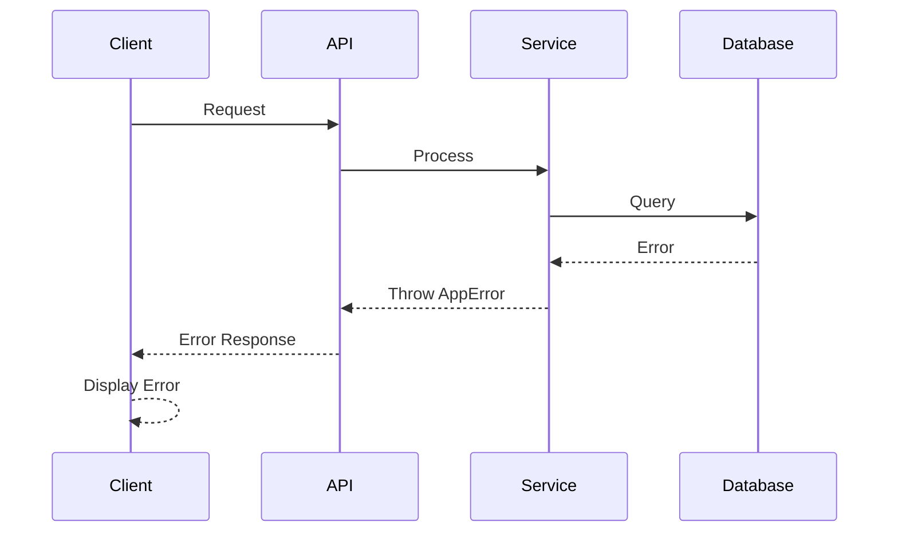

## Security and Performance

### Security Requirements

**Frontend Security:**

- CSP Headers: `default-src 'self'; script-src 'self' 'unsafe-inline' *.google-analytics.com`
- XSS Prevention: React's built-in escaping, sanitize user input
- Secure Storage: HttpOnly cookies for sessions, no sensitive data in localStorage

**Backend Security:**

- Input Validation: Zod schemas on all API endpoints
- Rate Limiting: 100 requests per minute per IP
- CORS Policy: Configured for specific origins only

**Authentication Security:**

- Token Storage: HttpOnly cookies with SameSite=Strict
- Session Management: Database sessions with 30-day expiry
- Password Policy: Minimum 8 characters, complexity requirements

### Performance Optimization

**Frontend Performance:**

- Bundle Size Target: < 300KB gzipped
- Loading Strategy: Code splitting, lazy loading, dynamic imports
- Caching Strategy: SWR for data fetching, service worker for assets

**Backend Performance:**

- Response Time Target: < 200ms p95
- Database Optimization: Indexed queries, connection pooling
- Caching Strategy: Redis for sessions, API response caching

## Testing Strategy

### Testing Pyramid

```text
        E2E Tests
       /        \
    Integration Tests
    /            \
Frontend Unit  Backend Unit
```

### Test Organization

#### Frontend Tests

```text
tests/
├── unit/
│   ├── components/
│   ├── hooks/
│   └── utils/
├── integration/
│   ├── pages/
│   └── api-client/
```

#### Backend Tests

```text
tests/
├── unit/
│   ├── services/
│   ├── validators/
│   └── utils/
├── integration/
│   ├── api/
│   └── database/
```

#### E2E Tests

```text
tests/
└── e2e/
    ├── auth/
    ├── checkout/
    └── admin/
```

### Test Examples

#### Frontend Component Test

```typescript
import { render, screen } from '@testing-library/react';
import { ProductCard } from '@/components/products/ProductCard';

describe('ProductCard', () => {
  it('displays product information', () => {
    const product = {
      name: 'Business Cards',
      price: 49.99,
      image: '/images/business-cards.jpg',
    };

    render(<ProductCard product={product} />);

    expect(screen.getByText('Business Cards')).toBeInTheDocument();
    expect(screen.getByText('$49.99')).toBeInTheDocument();
  });
});
```

#### Backend API Test

```typescript
import request from 'supertest'
import { app } from '@/app'

describe('GET /api/products', () => {
  it('returns product list', async () => {
    const response = await request(app).get('/api/products').expect(200)

    expect(response.body).toHaveProperty('products')
    expect(Array.isArray(response.body.products)).toBe(true)
  })
})
```

#### E2E Test

```typescript
import { test, expect } from '@playwright/test'

test('complete checkout flow', async ({ page }) => {
  await page.goto('/products')
  await page.click('text=Business Cards')
  await page.click('text=Add to Cart')
  await page.click('text=Checkout')

  await page.fill('[name=email]', 'test@example.com')
  await page.fill('[name=cardNumber]', '4242424242424242')
  await page.click('text=Place Order')

  await expect(page).toHaveURL(/\/order-confirmation/)
})
```

## Coding Standards

### Critical Fullstack Rules

- **Type Sharing:** Always define shared types in src/types and import from there
- **API Calls:** Never make direct fetch calls - use the service layer
- **Environment Variables:** Access only through config objects, never process.env directly
- **Error Handling:** All API routes must use the standard error handler
- **State Updates:** Never mutate state directly - use proper state management patterns
- **Database Access:** Always use Prisma ORM, never raw SQL
- **Authentication:** Check session on all protected routes
- **Validation:** Use Zod schemas for all user input

### Naming Conventions

| Element         | Frontend             | Backend    | Example             |
| --------------- | -------------------- | ---------- | ------------------- |
| Components      | PascalCase           | -          | `UserProfile.tsx`   |
| Hooks           | camelCase with 'use' | -          | `useAuth.ts`        |
| API Routes      | -                    | kebab-case | `/api/user-profile` |
| Database Tables | -                    | snake_case | `user_profiles`     |

## Error Handling Strategy

### Error Flow



### Error Response Format

```typescript
interface ApiError {
  error: {
    code: string
    message: string
    details?: Record<string, any>
    timestamp: string
    requestId: string
  }
}
```

### Frontend Error Handling

```typescript
// lib/error-handler.ts
export class ApiError extends Error {
  constructor(
    public code: string,
    public message: string,
    public details?: any
  ) {
    super(message)
  }
}

export function handleApiError(error: unknown): string {
  if (error instanceof ApiError) {
    return error.message
  }
  return 'An unexpected error occurred'
}
```

### Backend Error Handling

```typescript
// lib/api-error.ts
export class AppError extends Error {
  constructor(
    public statusCode: number,
    public code: string,
    message: string,
    public details?: any
  ) {
    super(message)
  }
}

export function errorHandler(error: unknown) {
  if (error instanceof AppError) {
    return NextResponse.json(
      {
        error: {
          code: error.code,
          message: error.message,
          details: error.details,
          timestamp: new Date().toISOString(),
          requestId: crypto.randomUUID(),
        },
      },
      { status: error.statusCode }
    )
  }

  return NextResponse.json({ error: { message: 'Internal server error' } }, { status: 500 })
}
```
