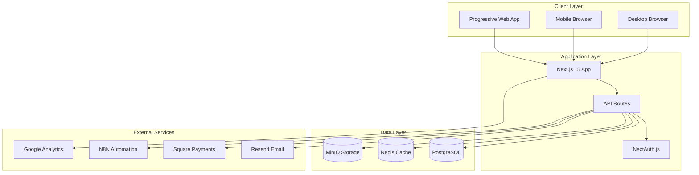

# GangRun Printing Fullstack Architecture Document

## Introduction

This document outlines the complete fullstack architecture for GangRun Printing, including backend systems, frontend implementation, and their integration. It serves as the single source of truth for AI-driven development, ensuring consistency across the entire technology stack.

This unified approach combines what would traditionally be separate backend and frontend architecture documents, streamlining the development process for modern fullstack applications where these concerns are increasingly intertwined.

### Starter Template or Existing Project

**Status**: Greenfield project with custom implementation

The project was built from scratch using Next.js 15 with modern best practices. No starter templates were used, allowing for complete customization to meet the specific requirements of the printing e-commerce platform.

### Change Log

| Date       | Version | Description                                                              | Author              |
| ---------- | ------- | ------------------------------------------------------------------------ | ------------------- |
| 2025-09-14 | 1.0     | Initial architecture document based on deployed implementation           | Winston (Architect) |
| 2025-09-15 | 1.1     | Updated with BMad Method compliance and remaining implementation details | Winston (Architect) |

## High Level Architecture

### Technical Summary

GangRun Printing is a Progressive Web App (PWA) built on Next.js 15 with App Router, providing a unified fullstack JavaScript/TypeScript architecture. The platform uses PostgreSQL for persistent data storage, Redis for caching, and MinIO for file storage. The frontend leverages React 19 with Tailwind CSS and shadcn/ui components for a modern, responsive UI. Backend services are implemented as Next.js API routes with Prisma ORM for database operations. The architecture achieves PRD goals through its modular design, supporting complex product configurations, multi-user roles, and scalable order processing workflows.

### Platform and Infrastructure Choice

**Platform:** VPS with Docker (via Dokploy)
**Key Services:** PostgreSQL, Redis, MinIO, N8N, Resend
**Deployment Host and Regions:** Single VPS instance at 72.60.28.175 (US Central)

### Repository Structure

**Structure:** Monolithic Next.js application
**Monorepo Tool:** N/A - Single application structure
**Package Organization:** Feature-based with shared components and utilities

### High Level Architecture Diagram

### Architectural Patterns

- **Jamstack Architecture:** Static generation with dynamic API routes - _Rationale:_ Optimal performance and SEO for product pages
- **Component-Based UI:** Reusable React components with TypeScript - _Rationale:_ Maintainability and type safety across large codebase
- **Repository Pattern:** Prisma ORM abstracts data access - _Rationale:_ Clean separation of concerns and testability
- **Server Components:** React Server Components for data fetching - _Rationale:_ Reduced client bundle size and improved performance
- **Hybrid Rendering:** Mix of SSG, SSR, and CSR as needed - _Rationale:_ Flexibility to optimize each page type
- **PWA Pattern:** Service worker with offline support - _Rationale:_ Enhanced user experience and mobile app-like features

## Tech Stack

### Technology Stack Table

| Category             | Technology                   | Version    | Purpose                    | Rationale                                        |
| -------------------- | ---------------------------- | ---------- | -------------------------- | ------------------------------------------------ |
| Frontend Language    | TypeScript                   | 5.9.2      | Type-safe development      | Catch errors at compile time, better IDE support |
| Frontend Framework   | Next.js                      | 15.5.2     | Full-stack React framework | App Router, RSC, built-in optimization           |
| UI Component Library | shadcn/ui                    | Latest     | Accessible components      | Customizable, owns the code, Radix UI based      |
| State Management     | Zustand                      | 5.0.4      | Client state management    | Simple, TypeScript-friendly, minimal boilerplate |
| Backend Language     | TypeScript                   | 5.9.2      | Type-safe backend          | Shared types with frontend                       |
| Backend Framework    | Next.js API Routes           | 15.5.2     | API endpoints              | Integrated with frontend, serverless-ready       |
| API Style            | REST                         | -          | HTTP APIs                  | Simple, well-understood, cacheable               |
| Database             | PostgreSQL                   | 15         | Primary database           | ACID compliance, JSON support for flexibility    |
| Cache                | Redis                        | 7.0        | Session & data cache       | High performance, pub/sub capability             |
| File Storage         | MinIO                        | Latest     | Object storage             | S3-compatible, self-hosted option                |
| Authentication       | NextAuth.js                  | 5.0.0-beta | Auth system                | Flexible providers, database sessions            |
| Frontend Testing     | Jest + React Testing Library | 29.5       | Unit/integration tests     | Standard React testing stack                     |
| Backend Testing      | Jest                         | 29.5       | API testing                | Consistent with frontend                         |
| E2E Testing          | Playwright                   | 1.49       | End-to-end tests           | Cross-browser, reliable                          |
| Build Tool           | Next.js CLI                  | 15.5.2     | Build system               | Integrated webpack config                        |
| Bundler              | Webpack (via Next.js)        | 5          | Module bundling            | Optimized by Next.js                             |
| IaC Tool             | Docker Compose               | 2.0        | Infrastructure             | Container orchestration                          |
| CI/CD                | GitHub Actions               | -          | Automation                 | Native GitHub integration                        |
| Monitoring           | Custom logging               | -          | Application logs           | Simple file-based logging                        |
| Logging              | File-based                   | -          | Log storage                | Local file system                                |
| CSS Framework        | Tailwind CSS                 | 4.1.13     | Utility-first CSS          | Rapid development, consistent design             |

